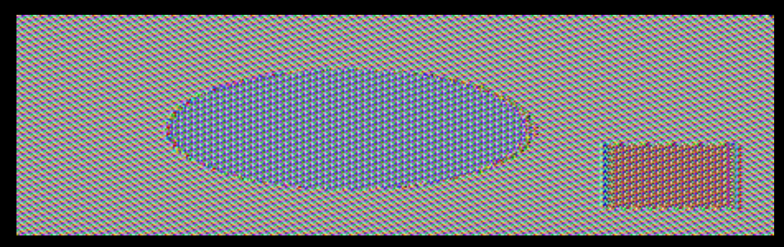
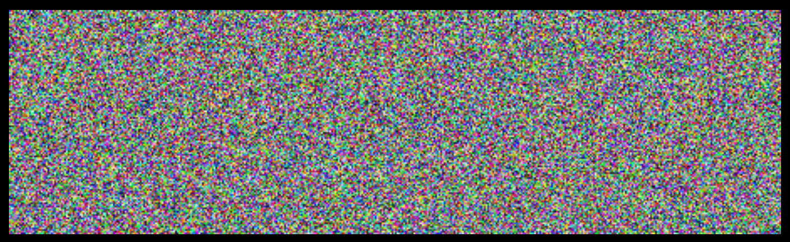

# Trabalho realizado na Semana #10 - Secret Key Encryption

## Task 1: Frequency Analysis

1. Our objective is to find the encryption key and the original plaintext by using frequency analysis.

2. Running a python file given, `freq.py`, the statistics for n-grams are produced and displayed:

```
1-gram (top 20):
n: 488
y: 373
v: 348
x: 291
u: 280
q: 276
m: 264
h: 235
t: 183
i: 166
p: 156
a: 116
c: 104
z: 95
l: 90
g: 83
b: 83
r: 82
e: 76
d: 59
-------------------------------------
2-gram (top 20):
yt: 115
tn: 89
mu: 74
nh: 58
vh: 57
hn: 57
vu: 56
nq: 53
xu: 52
up: 46
xh: 45
yn: 44
np: 44
vy: 44
nu: 42
qy: 39
vq: 33
vi: 32
gn: 32
av: 31
-------------------------------------
3-gram (top 20):
ytn: 78
vup: 30
mur: 20
ynh: 18
xzy: 16
mxu: 14
gnq: 14
ytv: 13
nqy: 13
vii: 13
bxh: 13
lvq: 12
nuy: 12
vyn: 12
uvy: 11
lmu: 11
nvh: 11
cmu: 11
tmq: 10
vhp: 10
```

```py
#!/usr/bin/env python3

from collections import Counter
import re

TOP_K  = 20
N_GRAM = 3

# Generate all the n-grams for value n
def ngrams(n, text):
    for i in range(len(text) -n + 1):
        # Ignore n-grams containing white space
        if not re.search(r'\s', text[i:i+n]):
           yield text[i:i+n]

# Read the data from the ciphertext
with open('ciphertext.txt') as f:
    text = f.read()

# Count, sort, and print out the n-grams
for N in range(N_GRAM):
   print("-------------------------------------")
   print("{}-gram (top {}):".format(N+1, TOP_K))
   counts = Counter(ngrams(N+1, text))        # Count
   sorted_counts = counts.most_common(TOP_K)  # Sort 
   for ngram, count in sorted_counts:                  
       print("{}: {}".format(ngram, count))   # Print
```


3. With this, by analysing the ciphertext.txt file and switching the letters to ones that we tought that made sense with the following command:

```
$ tr ’aet’ ’XGE’ < ciphertext.txt > out.txt
```

4. We ended finding the encryption key and the original plaintext:

```
$ tr ’ytnmhlqrabxvupzdcgisefjokw’ ’THEIRWSGCFOANDUYMBLKPVQJXZ’ < ciphertext.txt > out.txt
```

**Original plaintext:**
```
THE OSCARS TURN  ON SUNDAY WHICH SEEMS ABOUT RIGHT AFTER THIS LONG STRANGE
AWARDS TRIP THE BAGGER FEELS LIKE A NONAGENARIAN TOO

THE AWARDS RACE WAS BOOKENDED BY THE DEMISE OF HARVEY WEINSTEIN AT ITS OUTSET
AND THE APPARENT IMPLOSION OF HIS FILM COMPANY AT THE END AND IT WAS SHAPED BY
THE EMERGENCE OF METOO TIMES UP BLACKGOWN POLITICS ARMCANDY ACTIVISM AND
A NATIONAL CONVERSATION AS BRIEF AND MAD AS A FEVER DREAM ABOUT WHETHER THERE
OUGHT TO BE A PRESIDENT WINFREY THE SEASON DIDNT JUST SEEM EXTRA LONG IT WAS
EXTRA LONG BECAUSE THE OSCARS WERE MOVED TO THE FIRST WEEKEND IN MARCH TO
AVOID CONFLICTING WITH THE CLOSING CEREMONY OF THE WINTER OLYMPICS THANKS
PYEONGCHANG

ONE BIG QUESTION SURROUNDING THIS YEARS ACADEMY AWARDS IS HOW OR IF THE
CEREMONY WILL ADDRESS METOO ESPECIALLY AFTER THE GOLDEN GLOBES WHICH BECAME
A JUBILANT COMINGOUT PARTY FOR TIMES UP THE MOVEMENT SPEARHEADED BY 
POWERFUL HOLLYWOOD WOMEN WHO HELPED RAISE MILLIONS OF DOLLARS TO FIGHT SEXUAL
HARASSMENT AROUND THE COUNTRY

SIGNALING THEIR SUPPORT GOLDEN GLOBES ATTENDEES SWATHED THEMSELVES IN BLACK
SPORTED LAPEL PINS AND SOUNDED OFF ABOUT SEXIST POWER IMBALANCES FROM THE RED
CARPET AND THE STAGE ON THE AIR E WAS CALLED OUT ABOUT PAY INEQUITY AFTER
ITS FORMER ANCHOR CATT SADLER QUIT ONCE SHE LEARNED THAT SHE WAS MAKING FAR
LESS THAN A MALE COHOST AND DURING THE CEREMONY NATALIE PORTMAN TOOK A BLUNT
AND SATISFYING DIG AT THE ALLMALE ROSTER OF NOMINATED DIRECTORS HOW COULD
THAT BE TOPPED

AS IT TURNS OUT AT LEAST IN TERMS OF THE OSCARS IT PROBABLY WONT BE

WOMEN INVOLVED IN TIMES UP SAID THAT ALTHOUGH THE GLOBES SIGNIFIED THE
INITIATIVES LAUNCH THEY NEVER INTENDED IT TO BE JUST AN AWARDS SEASON
CAMPAIGN OR ONE THAT BECAME ASSOCIATED ONLY WITH REDCARPET ACTIONS INSTEAD
A SPOKESWOMAN SAID THE GROUP IS WORKING BEHIND CLOSED DOORS AND HAS SINCE
AMASSED  MILLION FOR ITS LEGAL DEFENSE FUND WHICH AFTER THE GLOBES WAS
FLOODED WITH THOUSANDS OF DONATIONS OF  OR LESS FROM PEOPLE IN SOME 
COUNTRIES


NO CALL TO WEAR BLACK GOWNS WENT OUT IN ADVANCE OF THE OSCARS THOUGH THE
MOVEMENT WILL ALMOST CERTAINLY BE REFERENCED BEFORE AND DURING THE CEREMONY 
ESPECIALLY SINCE VOCAL METOO SUPPORTERS LIKE ASHLEY JUDD LAURA DERN AND
NICOLE KIDMAN ARE SCHEDULED PRESENTERS

ANOTHER FEATURE OF THIS SEASON NO ONE REALLY KNOWS WHO IS GOING TO WIN BEST
PICTURE ARGUABLY THIS HAPPENS A LOT OF THE TIME INARGUABLY THE NAILBITER
NARRATIVE ONLY SERVES THE AWARDS HYPE MACHINE BUT OFTEN THE PEOPLE FORECASTING
THE RACE SOCALLED OSCAROLOGISTS CAN MAKE ONLY EDUCATED GUESSES

THE WAY THE ACADEMY TABULATES THE BIG WINNER DOESNT HELP IN EVERY OTHER
CATEGORY THE NOMINEE WITH THE MOST VOTES WINS BUT IN THE BEST PICTURE
CATEGORY VOTERS ARE ASKED TO LIST THEIR TOP MOVIES IN PREFERENTIAL ORDER IF A
MOVIE GETS MORE THAN  PERCENT OF THE FIRSTPLACE VOTES IT WINS WHEN NO
MOVIE MANAGES THAT THE ONE WITH THE FEWEST FIRSTPLACE VOTES IS ELIMINATED AND
ITS VOTES ARE REDISTRIBUTED TO THE MOVIES THAT GARNERED THE ELIMINATED BALLOTS
SECONDPLACE VOTES AND THIS CONTINUES UNTIL A WINNER EMERGES

IT IS ALL TERRIBLY CONFUSING BUT APPARENTLY THE CONSENSUS FAVORITE COMES OUT
AHEAD IN THE END THIS MEANS THAT ENDOFSEASON AWARDS CHATTER INVARIABLY
INVOLVES TORTURED SPECULATION ABOUT WHICH FILM WOULD MOST LIKELY BE VOTERS
SECOND OR THIRD FAVORITE AND THEN EQUALLY TORTURED CONCLUSIONS ABOUT WHICH
FILM MIGHT PREVAIL

IN  IT WAS A TOSSUP BETWEEN BOYHOOD AND THE EVENTUAL WINNER BIRDMAN
IN  WITH LOTS OF EXPERTS BETTING ON THE REVENANT OR THE BIG SHORT THE
PRIZE WENT TO SPOTLIGHT LAST YEAR NEARLY ALL THE FORECASTERS DECLARED LA
LA LAND THE PRESUMPTIVE WINNER AND FOR TWO AND A HALF MINUTES THEY WERE
CORRECT BEFORE AN ENVELOPE SNAFU WAS REVEALED AND THE RIGHTFUL WINNER
MOONLIGHT WAS CROWNED

THIS YEAR AWARDS WATCHERS ARE UNEQUALLY DIVIDED BETWEEN THREE BILLBOARDS
OUTSIDE EBBING MISSOURI THE FAVORITE AND THE SHAPE OF WATER WHICH IS
THE BAGGERS PREDICTION WITH A FEW FORECASTING A HAIL MARY WIN FOR GET OUT

BUT ALL OF THOSE FILMS HAVE HISTORICAL OSCARVOTING PATTERNS AGAINST THEM THE
SHAPE OF WATER HAS  NOMINATIONS MORE THAN ANY OTHER FILM AND WAS ALSO
NAMED THE YEARS BEST BY THE PRODUCERS AND DIRECTORS GUILDS YET IT WAS NOT
NOMINATED FOR A SCREEN ACTORS GUILD AWARD FOR BEST ENSEMBLE AND NO FILM HAS
WON BEST PICTURE WITHOUT PREVIOUSLY LANDING AT LEAST THE ACTORS NOMINATION
SINCE BRAVEHEART IN  THIS YEAR THE BEST ENSEMBLE SAG ENDED UP GOING TO
THREE BILLBOARDS WHICH IS SIGNIFICANT BECAUSE ACTORS MAKE UP THE ACADEMYS
LARGEST BRANCH THAT FILM WHILE DIVISIVE ALSO WON THE BEST DRAMA GOLDEN GLOBE
AND THE BAFTA BUT ITS FILMMAKER MARTIN MCDONAGH WAS NOT NOMINATED FOR BEST
DIRECTOR AND APART FROM ARGO MOVIES THAT LAND BEST PICTURE WITHOUT ALSO
EARNING BEST DIRECTOR NOMINATIONS ARE FEW AND FAR BETWEEN
```


## Task 2: Encryption using Different Ciphers and Modes

1. We encrypted and decrypted text files using the following command (with the 3 variations - -aes-128-cbc, -bf-cbc, -aes-128-cfb):

```
$ openssl enc -ciphertype -e -in plain.txt -out cipher.bin \
-K 00112233445566778889aabbccddeeff -iv 0102030405060708
```

2. We created a plain.txt file with the content and encrypted it:
**plain.txt:**
```
Bad boy Rafa
```

**Encrypt command:**
```
$ openssl enc -aes-128-cbc -e -in plain.txt -out cipher.bin \
-K 00112233445566778889aabbccddeeff -iv 0102030405060708
```

3. After, we decrypted it and obtained the same plain.txt content:

**Decrypt command:**
```
$ openssl enc -aes-128-cbc -d -in cipher.bin -out plain.txt \
-K 00112233445566778889aabbccddeeff -iv 0102030405060708
```

**plain.txt**
```
Bad boy Rafa
```


## Task 3: Encryption Mode – ECB vs. CBC

1. Now the objective is to encrypt and decrypt an  with both ecb and cbc.
We then provide the header of the original image to the body of each encryption to make them readable by image viewing software.

1.1. By using ecb we get the following image:



There's too much information that allows to reimagine the original picture. As the changes happen within blocks, there's little variations on how each pixel is changed. 

1.2. By using cbc we get the following image:



By naked eye it's impossible to see the original picture. This is due to the fact, that each block of code encryption is based on a previous block, adding more caos to the new information, creating a feeling of randomness.


# CTF10 - Weak Encryption

1. We analised the given `cipherspec.py` file and we found a vulnerability in the function gen(). This function is responsible for creating random byte keys, where the last 3 bytes with the value `0` are not fixated. With this, a brute force attack is possible since we only need to explore a vulnerability in those three last bytes:

```py
def gen():
    offset = 3
    key = bytearray(b'\x00' * (KEYLEN - offset))
    key.extend(os.urandom(offset))
    return bytes(key)
```

2. We retrieves the values cipher and nonce from the server:


3. We wrote a script that generates all 256^3 possible keys for accessing the flag, utilizing the dec() function from the cipherspec.py file:

```py
with open('text.txt', 'w') as file:
    for i in range(256):
        for j in range(256):
            for k in range(256):
                key = bytearray(b'\x00' * (KEYLEN - offset) + bytes([i, j, k]))
                
                decrypted_message = dec(key, cipher, nonce)
                decoded_message = decrypted_message.decode('ascii', 'backslashreplace')
                
                file.write(decoded_message)
                
                if decoded_message.startswith("flag"):
                    print(decoded_message)
```

4. With this, we aimed to save the results in a text.txt file and to print the values that start with `flag` in the console, but sadly something wrong happened and there was nothing printed in the console and this was the output of the file:
```
硜ㅡ屖㥸屡摸⑤硜改屣摸尷扸就摸乡硜敥硜敦䅔硜㕤䙒硜㡤硜慥硜㉢尕㡸䩥硜ㄹ㌟硜㉢唭硜ㅥ硜㑥塮硜戹Ѣ尵數䠸硜晡硜㤹硜捥ᅊ硜ㅤ硜㍣屋摸圴硜㥣硜㥡硜晣硜づ硜摦硜换硜㥦硜扤硜ㄹ硜ㅢ硜晣樆硜㌹‖硜㐹硜㡦圇彥硜づ㠢硜摣屜慸坡尉捸尹摸屣扸ⵢ硜敢硜摥⡝洔硜㙥硜㥡䁞硜捥恱硜㉥硜㉤ᔗ᝷尻晸屦摸尹捸尲摸履扸履㥸硢尹摸尲晸̴硜㝣ୌ弊尌數ሶ硜㑡硜て山捸て硜㤸硜㘸硜㑢硜㙦硜扥屛慸尶扸就㡸屢慸屦晸噢硜㡣硜㔸硜㌸硜ㅡ硜㑣硜敥硜㕦䤏尤捸尴扸尲㥸尹捸尶捸形硜ㄸ硜愹属㡸条硜㕢硜㉥屉慸╥屵慸屡扸尹摸尳㡸倶硜㉡硜捦ጭ䵿屦捸屣數屣摸ࡢ硜㉤䉻硜㐹ⴏ嘖硜㠸尔數尶㡸尵數尵㡸尰捸尶㥸層慸尶㡸ᅦ屛慸䱢就數履扸就晸㭦硜㍦硜㐹硜㌹穸屝㥸申縁硜慢硜㍤硜㕡硜㝦硜扤硜㑦硜捦硜つ屑㡸र硜㑥尌晸稸硜㍡硜扤硜㙣尔捸琲硜〸䵡彖硜愸尿摸䙢硜㉣屲㥸䕣䐞ᨴ尘㡸屣慸屡㥸⍤硜㘸㙖砵硜㐸屭捸屦數健灑硜慦外⌿嬣硜㈹硜㙢䰸ȹ硜ㅥ硜晦硜扣屓㡸㙦ฯ硜摣小㥸尷㡸尰慸尴扸塤專㡸尵摸䜸ᔳ硜㜹硜㥡屔晸䰹渼尒慸㉢硜㐹硜摣硜㜸屠扸ቦ硜㕤硜㘹屛捸朴硜捡屒扸屣慸ᐱ㜶屩扸攳硜㑢尳數屣數尲晸㠰硜㈹〖尷慸屦捸尵㡸尳摸就晸尶數欳硜扡笨硜慣屁扸尴扸尴扸䉣硜晥䌪畝尜捸形硜㈹硜扣硜捥䱶硜㡣䕂吁硜㡤硜㡡ㅔ硜㠸硜散硜㥥⡨䘾硜㍡硜ㄸൂ杢ᐅ硜㥥尬㡸㉣硜ぢ硜㉡⩺屋晸٤唷硜つ㝎硜戹奅硜㍢硜㡥硜㉢硜㉢硜㤹尭㥸尳㥸丱硜㥥告硜㉢硜㡢硜晥尷慸✲屚扸䘹恼硜㝥尐
...
```
