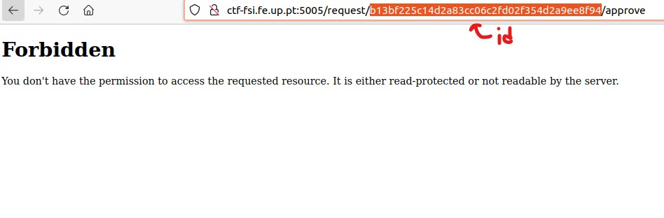

# CTF6 - Control The Flag (XSS + CSRF)

1. When entering the website, this is what was displayed:


2. After submiting some random text we got to a page that gave us a link to another page that showed us how the admin would check our request. This page had a `Give the flag` and `Mark request as read` buttons:


3. We thought that such strange feature would give us a hint on how to start the attack so by checking the HTML code of this page, we ended up finding a vulnerability:


4. We could simply use the code of the form and add some JavaScript so that it would activate, aproving our request and obtaining the flag:

```js
<form method="POST" action="http://ctf-fsi.fe.up.pt:5005/request/{insert id request}/approve" role="form"><div class="submit">  <input type="submit" id="giveflag" value="Give the flag"></div></form><script>document.getElementById("giveflag").click();</script>
```

5. To achieve such thing, we had to insert on the script above the id of the request given to us on the main page and then, by simply clicking on the submit button, the id of the flag is retrieved to us.



6. Finally, to get the value of the flag to conclude this CTF, we opened a seperate page with the main page source code and on the link we added the id of the request to access the flag:


