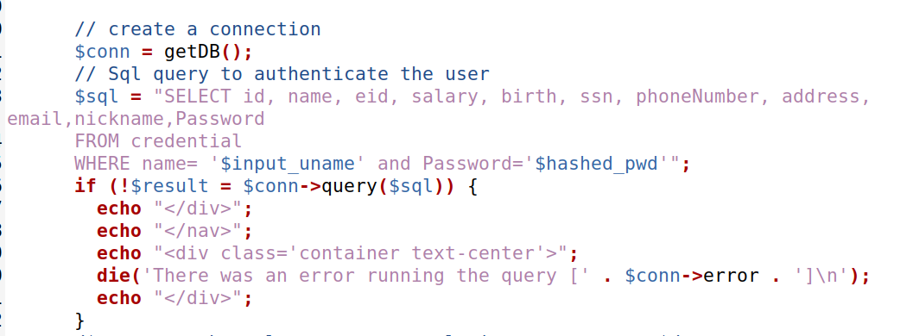

# Trabalho realizado na Semana #8 - SQL Injection Attack

For this week we where proposed to do tasks presented on this link: https://seedsecuritylabs.org/Labs_20.04/Web/Web_SQL_Injection/

## Task 1 - Get Familiar with SQL Statements

The task was to select the data of the user "Alice". As SQL is already well known, we easily arrive at the correct command to complete the task:

```sql
SELECT * FROM credentials WHERE Name = "Alice";
```

This is how we obtained all of Alice’s personal data:


## Task 2 - SQL Injection Attack on SELECT Statement

### Task 2.1 - SQL Injection Attack from webpage

We access the website "www.seed-server.com" provided by the Docker container and also the file `unsafe_home.php`. Then we could see that the query used is fragile because the server creates the command dynamically with unsanitized strings from the user input:



As the password field is encrypted, it is advantageous to usurp the search operation using only the username field.<br>
By using the "`admin' #`" input, we guarantee privileged access, as all keyword checking becomes irrelevant once it is commented out. Thus, the code executed on the server side became the following:

```sql
SELECT id, name, eid, salary, birth, ssn, address, email, nickname, Password
FROM credential
WHERE name='admin' # and Password=’$hashed_pwd’
```

As expected, we were able to log in with the administrator account and thus obtain all the data relating to the rest of the application's users:


### Task 2.2 - SQL Injection Attack from command line


# CTF - Control The Flag

When entering the website we are presented with a login page. To unlock the vault we need to provide an valid username and password combination.
The goal for this CTF is to log in as valid user. To achieve that, we can use SQL Injection, since the user inputs are not verified, nor used as parameters for the query.

This is the SQL query executed:
```php
$query = "SELECT username FROM user WHERE username = '".$username."' AND password = '".$password."'";
```

The input used is: `' or 1=1;#`
This input is always true and comments the part where the password is verified.


This is the SQL query that is actually executed:
```php
$query = "SELECT username FROM user WHERE username = '"' or 1=1;#"' AND password = '".$password."'";
```
We can successfully login and obtain the flag.

